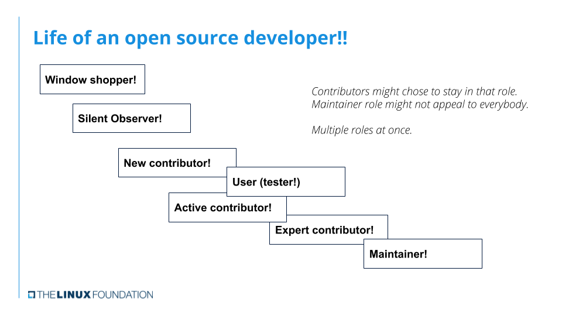

# Linux Kernel Development Environment setup

## Virtual machine

Create a virtual machine for safety. Create at least 50G virtual disk to store code. Because source code and build artifacts
can take 25-30GB.

## Environment

On development and test systems, it is a good idea to ensure there is ample space for kernels in the boot partition.
Choosing a whole disk install or setting aside 3 GB disk space for the boot partition is recommended.

	sudo apt-get install build-essential vim git cscope libncurses-dev libssl-dev bison flex

	sudo apt-get install git-email

Check [Minimal requirements to compile the Kernel](https://www.kernel.org/doc/html/latest/process/changes.html)

## Email

The next step is finding information on email clients and configuring your email client for sending patches and responding to emails.
Highly recommend using `git send-email` for sending patches.

    [sendemail]
        smtpserver = smtp.gmail.com
        smtpserverport = 587
        smtpencryption = tls
        smtpuser = <username>
        smtppass = <password>

Add above configuration in `.gitconfig` file and run 
    
    git send-email mypatch.patch

to send patches; `mypatch.patch` is generated by the `git format-patch` command.

### Things to remeber when email

- Bottom post
    Never top post in your response. Top posting is writing a message above the original text while sending a response to an email. 
    Add your response at the bottom of the original text. Bottom posting makes it easier to read and follow review comments on a patch.
- Inline post
    When reviewing or responding to a patch, deleting or stripping parts of the message you are not replying to is a good practice,
    and makes it easier to follow the responses in the thread.
- No HTML format
    Disable compose messages in HTML format. Patches sent using HTML format will be rejected
    by the development mailing lists automatically.
- No signatures
    Do not include private information in your signature.
    This is important for privacy reasons, as you are going to be posting to mailing lists.
- No attachments
    Do not send patches as attachments.
    In general, avoid attachments. Some exceptions are kernel logs or configuration files when reporting bugs.

Refer to [Email clients info for Linux](https://www.kernel.org/doc/html/latest/process/email-clients.html) for more details.
Generate an app-specific password for authentication if you have 2-factor on your Gmail account.

## Linux Kernel source
[The Linux Kernel Archives](https://www.kernel.org/)

### Linux mainline

Start by cloning Linus's tree which is called [Linux mainline](https://git.kernel.org/pub/scm/linux/kernel/git/torvalds/linux.git/)

    cd /linux_work
    git clone git://git.kernel.org/pub/scm/linux/kernel/git/torvalds/linux.git linux_mainline
    cd linux_mainline; ls -h

### Explore the Sources

[cregit-Linux](https://cregit.linuxsources.org/)

### Explore the linux-kselftest Repository

    cd  /linux_work
    git clone git://git.kernel.org/pub/scm/linux/kernel/git/shuah/linux-kselftest.git
    cd linux-kselftest
    
    git branch -a
    
    git checkout next

## Building and Installing First Kernel

### Clone the Stable kernel git
    
    git clone git://git.kernel.org/pub/scm/linux/kernel/git/stable/linux-stable.git -n
    cd linux-stable
    git branch -a | grep linux-6
    git checkout linux-5.19.y

Copy old kernel config file from `/boot/config-5.*` to source directory
    
    cp /boot/cofig-5.15.0-89-generic .config

Make sure to comment out 

    CONFIG_SYSTEM_TRUSTED_KEYS="debian/canoical-certs.pem"
    CONFIG_SYSTEM_REVOCATION_KEYS="debian/canonical-revoked-certs.pem"

config since it is debian specific config.

    make oldconfig

Hold enter to select all new default flags.

Start building.

    make -j4 all

    make modules_install install

### Making change to driver uvcvideo

    vim drivers/media/usb/uvc/uvc_driver.c

    static int uvc_probe(struct usb_interface *intf, const struct usb_device_id *id)
    {
        // ...
        // int ret;
    +    pr_info("I changed uvcvideo driver in the Linux kernel\n");
        // ...
    }

Configure `CONFIG_USB_VIDEO_CLASS=y` and reocmpile and install.

    modprobe uvcvideo
    dmesg | less
    /I changed

    No result

    rmmod uvcvideo
    lsmod | grep uvcvideo

Add USB integrated webcam to VM, and run `modprobe uvcvideo` again and search for `I changed` and see result.

### Practicing commits

    git diff | ./scripts/checkpatch.pl
    total: 0 errors, 0 warnings, 7 lines checked
    Your patch has no obvious style problems and is ready for submisison.

### Sending a patch for review

The next step is learning the logistics of how to send a patch to the Linux Kernel mailing lists for review. The `get_maintainer.pl` script tells you whom to send the path to.

    ./scripts/get_maintainer.pl 0001-chore-add-log-to-uvcvideo-mod.patch 
    Laurent Pinchart <laurent.pinchart@ideasonboard.com> (maintainer:USB VIDEO CLASS)
    Mauro Carvalho Chehab <mchehab@kernel.org> (maintainer:MEDIA INPUT INFRASTRUCTURE (V4L/DVB))
    linux-media@vger.kernel.org (open list:USB VIDEO CLASS)
    linux-kernel@vger.kernel.org (open list)

At this time, you can run:
    
    git format-patch -1 <commit ID> --to=laurent.pinchart@ideasonboard.com \
        --to=mchehab@kernel.org --to=linux-media@vger.kernel.org \
        --to=linux-kernel@vger.kernel.org

This will generate a patch. You can then send this patch using:

    git send-email <patch-file>

### The review process

Patch will get comments from reviewers with sugestions for improvements and, in some cases, learning to now more about the change itself. Please be pationt and wait for a minimum
of one week before requesting a response. During merge windows and other busy times, it might take loger than a week to get a response. Also make sure to send the patch to the right recipients.

Please thank the reviewers for their comments and address them. Don't hesitate to ask a clarifying question if you don't understand the comment. When you send a new version of your patch, add a version history describing the changes made in the new version. The right place for the version history is after the "---" below the **Signed-off-by** tag and the start of the changed file list. Don't include version history in the commit log.

### Best practices for sending patches

- Run `scripts/checkpatch.pl` before sending the patch. Note that checkpatch might 
suggest canges that are unecessary! Use your best judgement when deciding whether t makes sense to make the change suggested. The end goal is for the code to be more reaable. If checkpatch.pl suggests a change and you think the end result is not more readable, don't make the change.
- Compile and test your change.
- Document your change and include releveant testing details and results of that testing.
- **Signed-off-by** shoud be the last tag
- As a general rule, don't include change lines in the commit log.
- Remeber that good patches get accepted quicker. It is important to understant how to create good patches.
- Copy mailing lists and maintainers/developers suggested by scripts/get_maintainer.pl.
- Be patient and wait for a minimum of one week before requesting for comments. 
- Always thank the reviewers for their feedback and address them.
- Don't hesitate to ask a clariying question if you don't understand the comment.
- When working on a patch based on a suggested idea, make sure to give credit using the 
**Suggested-by** tag. [ Other tags  ](https://www.kernel.org/doc/html/latest/process/submitting-patches.html#using-reported-by-tested-by-reviewed-by-suggested-by-and-fixes) used for giving credit are **Tested-by**, **Reported-by**.
- Remembre that the reviewers help improve code. Don't take it personally and handle the feedback gracefully. Please don't do top post when responding to emails. Responses shoud be inlined.
- Keep in mind that the community doesn't have any obligation to accept your patch. Patches are pulled, not pushed. Always give a reason for the maintainer to take your patch.
- Be patient and be ready to make changes and working with the reviewers. It could take multiple versions before your patch gets accepted. It is okay to disaggree with maintanersand reviewers. Please don't ignore a review because you disagree with it. Present your reasons for disagreeing, along with supporting technical data such as benchmarks and other improvements.
- In general, getting response and comments is a good sign that the community likes the patches and wants to see it improved. Silience is what you want to be concerned about. If you don't hear any response back from the maintainer after a week, feel free to either send the patch again, or send a gentle "ping" - something like "Hi, I know you are busy, but have you found time to look at my patch?"
- Expect to receive comments and feedback at any time during hte review process.
- Stay engaged and be ready to fix problems, if any, after the patch gets accepted into linux-next for integration into the mainline. Kernel build and CI bots and rings usually find problems.
- When a patch gets accepted, you will either see an email from the maintainer or an automated patch accepted email with information on which tree it has been applied to, and some estimate on when you can expect to see it in the mainline kernel. Not all maintainers might send and email when the patch gets merged. The patch could stay in linux-next for integration until the next merge window, before it gets into Linus's tree. Unless the patch is an acutal fix to a bug in Linus's tree, in which case, it may go directly into his tree.
- Sometimes you need to send muliple related patches. This is useful for grouping, say, to group driver clean up patches for one particular driver into a set, or grouping patches that are part of a new feture into one set. `git format-patch -2 -s --cover-letter --thread --subject-prefix="PATCH v3" --to="email" --cc="email"` will create a threaded patch series athat includes the top two commits and genrated cover letter template. It is a good practice to send a cover letter when sedning a patch series.
- Including patch series version history in the cover letter will help revieweers get a quick snapshot of changes from version to version.
- When a maintainer accepts a patch, the maintainer assumes maintainance responsibility for that patch. As a result, maintainers have decision power on how to manage patch flow into their individual sub-system(s) and they also have individual preferences. Be prepared for maintianer-to-maintainer differences in commit log conent and sub-system specific coding styles.

### Post-commit hooks

Check the patch for compliance and errors can be utomated using git pre-commit and post-commit hooks. 
If you don't already have `/usr/share/codespell/dictionary.txt` do:

    sudo apt-get install codespell

Add `.git/hooks/post-commit` file
        
    #!bash
    #!/bin/sh
    exec git show --format=email HEAD | ./scripts/checkpatch.pl --strict --codespell

    chmod a+x .git/hooks/post-commit

After you make the commit, this hook will output any `checkpatch` errors or warnings that
your patch creates. If you see warnings or errors that you know you added, you can ammed the commit by changing the file, using git add to add the changes, and then using
`git commit --amend` to comit the chagnes.

## Introduction to Kernel and Driver building, loading and Dependencies

After making changes to a driver, it will be easier to compile just the driver first,
instead of kicking off a complete kernel build. After building the module, it can 
be reloaded instead of rebooting the system.

### Compiling a single source file

So far, we talked about compiling the entire kernel. Next, let's see how we can build a 
driver or module or a signle source file in the kernel.

Compiling a single source file: `make path/file.o`

Compiling a directory: `make path`

    make M=drivers/media/test-drivers/vimc

      CC [M] drivers/media/test-drivers/vimc/vimc-core.o
      CC [M] drivers/media/test-drivers/vimc/vimc-common.o
      CC [M] drivers/media/test-drivers/vimc/vimc-streamer.o
      CC [M] drivers/media/test-drivers/vimc/vimc-capture.o
      CC [M] drivers/media/test-drivers/vimc/vimc-debayer.o
      CC [M] drivers/media/test-drivers/vimc/vimc-scaler.o
      CC [M] drivers/media/test-drivers/vimc/vimc-sensor.o
      LD [M] drivers/media/test-drivers/vimc/vimc.o
      Building modules, stage 2.
      MODPOST 1 modules
      CC drivers/media/test-drivers/vimc/vimc.mod.o
      LD [M] drivers/media/test-drivers/vimc/vimc.ko

Sometimes, it is  hard to figure out all the dependencies for a module, or a driver, or a configuration option. Until all the dependencies are enabled, the dirver you are 
loking to enable will not be enabled.

Let's take a look at `drivers/media/test-drivers/vimc/Kconfig`.

    config VIDEO_VIMC
        tristate "Virtual Media Controller Driver (VIMC)"
        depends on VIDEO_DEV && VIDEO_V4L2 && VIDEO_V4L2_SUBDEV_API
        select VIDEOBUF2_VMALLOC
        select VIDEO_V4L2_TPG
        help
         Skeleton driver for Virtual Media Controller

         This driver can be compared to the vivid driver for emulating
         a media node that exposes a complex media topology. The topology
         is hard coded for now but is meant to be highly configurable in
         the future.

         When in doubt, say N.

We can see that vimc can be enabled by changing the `CONFIG_VIDEO_VIMC` option. It is
a tristate driver. What that means is that it can be:   
    - enabled as a built-n
    - enabled as a module
    - disbled.

It depends on `CONFIG_VIDEO_DEV`, `CONFIG_VIDEO_V4L2`, and `CONFIG_VIDEO_V4L2_SUBDEV_API` to enabled. It will also autoselect `CONFIG_VIDEOBUF2_VMALLOC` and `CONFIG_VIDEO_V4L2_TPG`.
    - Enable as a module: `CONFIG_VIDEO_VIMC=m`
    - Enalbe as built-in: `CONFIG_VIDEO_VIMC=y`
    - Disable: `CONFIG_VIDEO_VIMC=n` or `#CONFIG_VIDEO_VIMC`

Some options are boolean, thatm eans these modules or options can be enabled or disabled. It might take a couple of attepts to enable all the dependencies. We recommend using
`make menuconfig` to enable drivers and other configuration options.

Vimc resides under the **Device Drivers** option. Using the down arrow, you can navigate to the option and take a look at what is in there.

Use "/" to search. Now navigate to "Multimedia support" and "Media  drivers" and "V4L test drivers" option. 
You will finally see `vimc` there.

In our configuration, we have it enabled as a module. If you would like to change it, scroll down and this will highlight the `M`, at which point you can change it with `Y`, `M`, `N` key.

## All about testing

### Kernel CI

[Dashboard](https://linux.kernelci.org/job/)

### Applying patches

    git apply --index file.patch

### Basic testing

Once a new kernel is installed, the next step is to try to boot it and see what happens. Once the new kernel is up and running, check dmesg for any regressions. Run a few usage tests:
    - Is networking functional?
    - Does ssh work?
    - Run rsync of a large file over ssh
    - Run `git clone` and `git pull`
    - Start a web browser
    - Read email
    - Download files: `ftp, wget, etc`
    - Play audio/video files
    - Connect new USB devices - mouse, USB stick, etc

### Examining Kernel logs

General rule: there should be no new `crit, alert and emerge` level messages in `dmesg`.
There should be no new `err` level messages. Pay close attention to any new warn level
messages as well.

    dmesg -t -l emerg
    dmesg -t -l crit
    dmesg -t -l alert
    dmesg -t -l err
    dmesg -t -l warn
    dmesg -t -k
    dmesg -t 

Are there any stack traces resulting from `WARN_ON` in the `dmesg`? These are serious 
problems that require further investigation.

### Stress testing

Running 3 to 4 kernel compiles in parallel is a good overall stress test. Compare times 
with old runs of this test for regressions in performance. Longer compile times could be indicators of performance regression in one of the kernel modules.

### Debug options and proactive testing

It is important to remember to enable the `Lock Debugging` and `CONFIG_KASAN` for memory
leak detection. Enabling these configuration options is recommended for testing your
changes to the kernel:

    CONFIG_KASAN
    CONFIG_KMSAN
    CONFIG_UBSAN
    CONFIG_LOCKDEP
    CONFIG_PROVE_LOCKING
    CONFIG_LOCKUP_DETECTOR

Run `git grep -r DEBUG | grep Kconfig` can find all supported debug configuration options.

## Debugging basic

Things to try when kernel doesn't boot, or when the kernel is crashing, or when a driver
isn't working the way it shoud.

### Debugging overview

There is no step by step procedure or a single recipe for success when debugging a 
problem. Asking the following questions can help to understand and identify the nature
of the problem and how best to sove it:

- Is the problem easily reproducible?
- Is there a reproducer or test that can trigger the bug consistently?
- Are there any panic, or error, or debug messages in the dmesg when the bug is triggered?
- Is reproducing the problem time-sensitive?

Easily reproducible bugs with a test to trigger make it easier to debug, identify the problem, fix it and verify the fix. Time-sensitive problems could be a result of race conditions, and these are harder to debug and fix.

### What's in a panic message?

Read following blogs
- [Debugging Analysis of Kernel panics and Kernel oopses using System Map](https://sanjeev1sharma.wordpress.com/tag/debug-kernel-panics/)
- [Understanding a Kernel Oops!](https://www.opensourceforu.com/2011/01/understanding-a-kernel-oops/)

### Decode and analyze the panic message

Need actual practice
Panic messages can be decoded using the decode_stacktrace.sh tool. Please refer to decode_stacktrace: make stack dump output useful again for details on how to use the tool.

### Use event tracing to debug

[Event Tracing page in the Linux Kernel Documentation](https://www.kernel.org/doc/html/latest/trace/events.html)
Need actual practice

Enable all events:

      cd /sys/kernel/debug/tracing/events
      echo 1 > enable 

Enable the skb events:

      cd /sys/kernel/debug/tracing/events/skb
      echo 1 > enable

## Tips

There are several ways to get started and contribute to the kernel. A few ideas:

- Subscribe to the [Linux Kernel mailing list](http://vger.kernel.org/vger-lists.html) for the area of your interest.
- Follow the development activity reading the [Linux Kernel Mailing List Archives](https://lore.kernel.org/lists.html).
- Join the `#kernelnewbies` IRC channel on the [OFTC IRC network](https://www.oftc.net/). Several of us developers hang out on that channel. This server is home to `#mm, #linux-rt`, and several other Linux channels.
- Join the #linux-kselftest, #linuxtv, #kernelci, or #v4l IRC channels on freenode.
    - This server recommends Nick registration. Server Name: irc.freenode.net/6667. You can register your Nick in the server tab with the command: `identify /msg NickServ identify <password>`
    - You can configure your chat client to auto-identify using the NickServ(/MSG NickServ+password) option - works on hexchat.
- Find spelling errors in kernel messages.
- Static code analysis error fixing: Static code analysis is the process of detecting errors and flaws in the source code. The Linux kernel Makefile can be invoked with options to enable to run the [Sparse source code checker](https://www.kernel.org/doc/html/latest/dev-tools/sparse.html) on all source files, or only on the re-compiled files. Compile the kernel with the source code checker enabled and find errors and fix as needed.
- Fix the [Syzbot](https://syzkaller.appspot.com/upstream) null pointer dereference and WARN bug reports which include the reproducer to analyze. Run the reproducer to see if you can reproduce the problem. Look at the crash report and walk through sources for a possible cause. You might be able to fix problems.
- Look for opportunities to add/update .gitignore files for tools and Kselftest. Build tools and Kselftest and run git status. If there are binaries, then it is time to add a new .gitignore file and/or an entry to an existing .gitignore file.
- Run mainline kernels built with the CONFIG_KASAN, Locking debug options mentioned earlier in the debugging section, and report problems if you see any. This gives you an opportunity to debug and fix problems. The community welcomes fixes and bug reports
